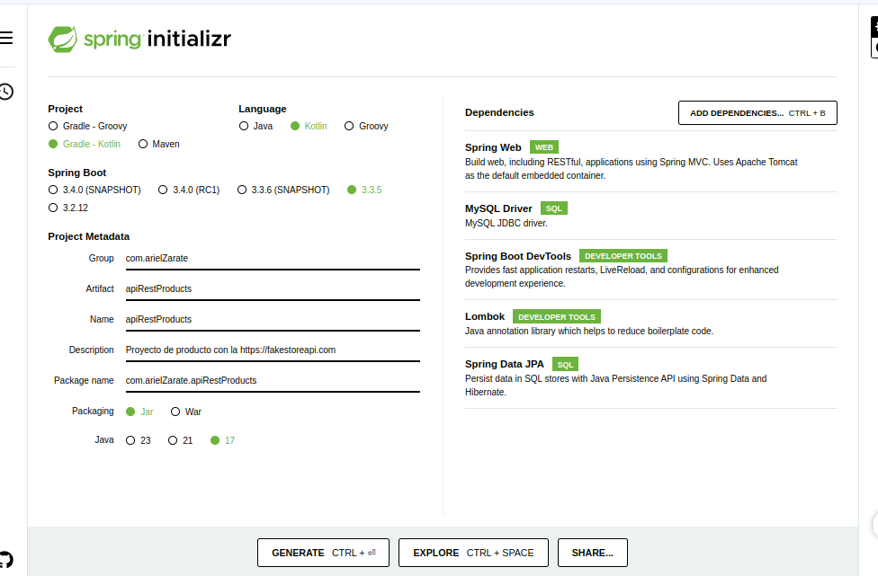
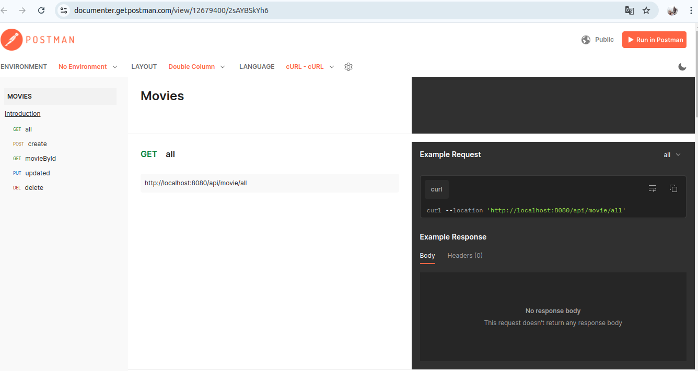

# Getting Started

### Reference Documentation
For further reference, please consider the following sections:

* [Official Gradle documentation](https://docs.gradle.org)
* [Spring Boot Gradle Plugin Reference Guide](https://docs.spring.io/spring-boot/3.3.6/gradle-plugin)
* [Create an OCI image](https://docs.spring.io/spring-boot/3.3.6/gradle-plugin/packaging-oci-image.html)
* [Spring Web](https://docs.spring.io/spring-boot/3.3.6/reference/web/servlet.html)
* [Spring Data JPA](https://docs.spring.io/spring-boot/3.3.6/reference/data/sql.html#data.sql.jpa-and-spring-data)

### Guides
The following guides illustrate how to use some features concretely:

* [Building a RESTful Web Service](https://spring.io/guides/gs/rest-service/)
* [Serving Web Content with Spring MVC](https://spring.io/guides/gs/serving-web-content/)
* [Building REST services with Spring](https://spring.io/guides/tutorials/rest/)
* [Accessing Data with JPA](https://spring.io/guides/gs/accessing-data-jpa/)

### Additional Links
These additional references should also help you:

* [Gradle Build Scans – insights for your project's build](https://scans.gradle.com#gradle)


# backend con kotlin


## creacion del proyecto




(siemore verificar que este instalado el jdk para iniciar)
## VARIABLES 

-  val
   ```kotlin
   val pi:Double = 3.14159  // La constante pi no cambia
   val name:String = "Alice" // El nombre de una persona no debería cambiar
   ```

- var 
```kotlin

var counter = 0  // El contador puede cambiar
counter += 1     // Se puede modificar

 ```


## clases

En Kotlin, se utiliza la palabra clave `data`  class para crear clases que se 
utilizan principalmente para representar entidades de datos, mientras que en Java,
se usa simplemente class para definir cualquier tipo de clase. 
Aquí te explico las diferencias clave:

### Kotlin: data class
En Kotlin, una data class es un tipo especial de clase diseñada para almacenar datos de manera eficiente. Al marcar una clase como data, Kotlin automáticamente genera varios métodos útiles para esa clase:
1. data class: Las data classes en Kotlin generan automáticamente:
- toString(): Genera una representación legible de la clase, mostrando todos sus campos.
- equals(): Compara dos objetos de la clase para ver si son iguales (basado en los campos).
- hashCode(): Genera un código hash para el objeto, útil para usar en colecciones como HashSet o HashMap.
- copy(): Permite crear una copia de un objeto con cambios específicos en algunos de sus campos.
 

```kotlin
data class Movie(
    val id: Long = 0,
    val title: String = "",
    val director: String = ""
)

```
En Kotlin, no es necesario utilizar Lombok porque el lenguaje ofrece características nativas que permiten reducir la cantidad de código repetitivo de manera similar a lo que Lombok hace en Java.


## constructor
Constructor Primario en Kotlin
En Kotlin, el constructor primario se declara directamente en la cabecera de la clase. 
Si usas val o var en los parámetros, Kotlin genera automáticamente los getters 
(y los setters para las propiedades var).


```kotlin
data class User(val name: String, val age: Int)

```


En Kotlin, el constructor se maneja de manera diferente a Java. Cuando defines una data class o una clase normal, Kotlin genera el constructor primario automáticamente a partir de los parámetros definidos en la clase. El constructor no se define explícitamente con la palabra clave constructor, sino que se declara directamente en la declaración de la clase.

Constructor Primario en Kotlin
En Kotlin, el constructor primario se declara directamente en la cabecera de la clase. Si usas val o var en los parámetros, Kotlin genera automáticamente los getters (y los setters para las propiedades var).

Ejemplo de constructor primario en una data class:
kotlin
Copiar código
data class User(val name: String, val age: Int)
Aquí, Kotlin genera automáticamente:

Un constructor que recibe los parámetros name y age como argumentos.
Los getters para acceder a esos valores.
Los setters si las propiedades son var.
Los métodos toString(), equals(), hashCode().
El código generado implícitamente por Kotlin sería equivalente a algo como esto:

kotlin
Copiar código
class User(val name: String, val age: Int) {
override fun toString(): String {
return "User(name=$name, age=$age)"
}

    override fun equals(other: Any?): Boolean {
        if (this === other) return true
        if (javaClass != other?.javaClass) return false
        other as User
        if (name != other.name) return false
        if (age != other.age) return false
        return true
    }

    override fun hashCode(): Int {
        var result = name.hashCode()
        result = 31 * result + age
        return result
    }
}
Constructor secundario (si lo necesitas):
Si necesitas más de un constructor, puedes definir un constructor secundario en Kotlin con la palabra clave constructor. Este es útil si deseas crear constructores adicionales para diferentes formas de inicializar la clase.

Ejemplo de constructor secundario:

```kotlin

class User(val name: String, val age: Int) {
    constructor(name: String) : this(name, 0)  // Constructor secundario con valor por defecto para `age`
}

```


## DTO
Un DTO (Data Transfer Object) como el que has creado (MovieDTO) es un objeto diseñado específicamente para transferir datos entre diferentes capas de una aplicación sin exponer directamente las entidades del modelo de dominio o la base de datos

```kotlin

//dto una clase para pasar datos entre capas
//sin exponer la clase entidad que se encargara d ela persistencia
class MovieDTO (
   var id:Long?=null,
   var name:String,
    var rating:Double
    )
```
adjunto a esto tengo el MovieMapper

## MovieMapper :Mapper


Un mapper transforma entre la entidad (Movie) y el DTO (MovieDTO). Esto te permite trabajar en tu capa de lógica con la entidad mientras limitas lo que se expone al cliente:

```kotlin
class MovieMapper {
    fun fromEntity(movie: Movie): MovieDTO {
        return MovieDTO(
            id = movie.id,
            name = movie.name,
            rating = movie.rating
        )
    }

    fun toEntity(movieDTO: MovieDTO): Movie {
        return Movie(
            name = movieDTO.name,
            rating = movieDTO.rating
        )
    }
}


```

### INTERFACE MAPPER

```kotlin


interface Mapper<D,E> {

    //interface simple para poder ser implementada

    fun fromEntity(entity:E):D
    fun toEntity(domain:D):E
}
```

# service


## MovieService(interface) 
La interfaz MovieService define el contrato de servicio para las operaciones relacionadas con las películas en tu aplicación. Esto significa que establece las funcionalidades que cualquier clase que implemente esta interfaz debe proporcionar. Es una forma de organizar y estructurar tu código que ofrece flexibilidad, escalabilidad y claridad.
```kotlin


//esta interface sirve para poder implementar los servicios de movie
interface MovieService {


fun createMovie(movieDTO:MovieDTO): MovieDTO //crea una nueva movie

fun getMovies():List<MovieDTO>

fun getMovie(id:Long):MovieDTO

fun updateMovie(movie: MovieDTO,id:Long):MovieDTO

//fun deleteMovie(id:Long):String

fun deleteMovie(id:Long)

}
```

## MovieServiceImpl
La clase MovieServiceImpl es una implementación concreta de la interfaz MovieService. Se encarga de la lógica de negocio para gestionar las películas y utiliza las siguientes dependencias para realizar su trabajo:

MovieRepository: Para interactuar con la base de datos.
MovieMapper: Para convertir entre objetos de tipo entidad (Movie) y DTO (MovieDTO).
MovieValidator: Para validar los datos de las películas antes de procesarlo

```kotlin
package com.arielzarate.api_rest.service

import com.arielzarate.api_rest.common.MovieValidator
import com.arielzarate.api_rest.dto.MovieDTO
import com.arielzarate.api_rest.dto.MovieMapper
import com.arielzarate.api_rest.entity.Movie
import com.arielzarate.api_rest.exception.MovieException
import com.arielzarate.api_rest.repository.MovieRepository
import org.springframework.stereotype.Service
import java.util.Optional


@Service
class MovieServiceImpl(
    private val movieRepository: MovieRepository,
    private val movieMapper: MovieMapper,
    private val movieValidator :MovieValidator
):MovieService {


    override fun createMovie(movieDTO: MovieDTO):MovieDTO {

        //validateMovie(movieDTO)
        movieValidator.validate(movieDTO);  //este ya es un componente asignado para validar
        val movie=movieMapper.toEntity(movieDTO)
        movieRepository.save(movie);//guardo la entidad en persistencia

        return movieMapper.fromEntity(movie);
       // return movieDTO;
    }

    override fun getMovies(): List<MovieDTO> {
   /*

   //opcion 1
         val movieIterable= movieRepository.findAll()
        //movies son de tipo Movie
        val movies= movieIterable.map { movie->
            movieMapper.fromEntity(movie)
        }

      //ahora que tengo todos los movies dto en movie retorno
        return movies;
   * */


        //opcion 2

        val movies= movieRepository.getAllMovies();
        return  movies.map{m-> movieMapper.fromEntity(m)}
    }

    override fun getMovie(id: Long): MovieDTO {
       val movie = movieRepository.findById(id).orElseThrow{
           MovieException("La pelicula con el id $id no fue encontrada")
        }

        return movieMapper.fromEntity(movie)

    }

    override fun deleteMovie(id: Long) {
       val exist=movieRepository.existsById(id)
        if(!exist)
        {
            throw  MovieException("no se encuentra la movie con el id:$id")
        }
        movieRepository.deleteById(id);
      //  return "La movie fue eliminada con exito"
    }

    override fun updateMovie(movie: MovieDTO,id: Long):MovieDTO {

        val existingMovie = movieRepository.findById(id).orElseThrow {
            MovieException("La película con id $id no fue encontrada")
        }

        //existing movie es una movie no un  dto
        existingMovie.name=movie.name;
        existingMovie.rating=movie.rating;
       //lo guardo
       movieRepository.save(existingMovie)

       //ahora retorno pero con el mapper echo

       return movieMapper.fromEntity(existingMovie);

    }


 
}

```

Uso de Inyección de Dependencias:

- Las dependencias como MovieRepository, MovieMapper, y MovieValidator se inyectan automáticamente gracias a la anotación @Service. Esto sigue los principios de inversión de dependencias y facilita las pruebas.
-  Uso del Mapper (MovieMapper):
   Separa la lógica de conversión entre entidades y DTOs, lo que mantiene la implementación más limpia y modular.

- Validaciones con MovieValidator:
   Centraliza la lógica de validación en un componente reutilizable. Esto asegura que las reglas de validación sean consistentes en toda la aplicación.
 
- Gestión de Errores:
   Utiliza una excepción personalizada MovieException para manejar casos donde las películas no se encuentran o los datos son inválidos. Esto mejora la claridad y el control del flujo.


## Repository

La interfaz MovieRepository que proporcionas está usando Spring Data JPA, lo que permite manejar las operaciones CRUD (Crear, Leer, Actualizar, Eliminar) sin necesidad de escribir implementaciones específicas. En su lugar, Spring Data JPA proporciona automáticamente implementaciones para las interfaces que extienden de JpaRepository.

```kotlin
@Repository
interface MovieRepository : JpaRepository<Movie, Long> {
    
    @Query("SELECT m FROM Movie as m")
    fun getAllMovies(): List<Movie>
}


```


# controller 
Este controlador gestiona las operaciones CRUD (Crear, Leer, Actualizar, Eliminar) para las películas usando el servicio MovieService
```kotlin
package com.arielzarate.api_rest.controller

import com.arielzarate.api_rest.dto.MovieDTO
import com.arielzarate.api_rest.service.MovieService
import org.springframework.http.HttpStatus
import org.springframework.http.ResponseEntity
import org.springframework.web.bind.annotation.DeleteMapping
import org.springframework.web.bind.annotation.GetMapping
import org.springframework.web.bind.annotation.PathVariable
import org.springframework.web.bind.annotation.PostMapping
import org.springframework.web.bind.annotation.PutMapping
import org.springframework.web.bind.annotation.RequestBody
import org.springframework.web.bind.annotation.RequestMapping
import org.springframework.web.bind.annotation.RestController


@RestController
@RequestMapping("/api/movie/")

//inyeccion de dependencias mediante interfaces
class MovieController(
    private val movieService: MovieService
) {


   @GetMapping("/all")
  fun getMovies():ResponseEntity<Any>{
      val movies=movieService.getMovies();
    return ResponseEntity.ok(movies);
  }

    @GetMapping("/{id}")
    fun getMovie(@PathVariable id:Long):ResponseEntity<Any>{
        val movieFound=movieService.getMovie(id);
        return ResponseEntity.ok(movieFound);
    }


    @PostMapping("/save")
   fun createMovie(@RequestBody movieDTO: MovieDTO):ResponseEntity<Any>{

     //  return try {
           val savedMovie = movieService.createMovie(movieDTO)
         return   ResponseEntity(savedMovie, HttpStatus.CREATED)
    /*
       } catch (e: IllegalArgumentException) {
           ResponseEntity(e.message, HttpStatus.BAD_REQUEST) // Mensaje claro para el cliente
       } catch (e: Exception) {
           ResponseEntity("Error interno del servidor", HttpStatus.INTERNAL_SERVER_ERROR)
       }
    * */
   }


    @PutMapping("/update/{id}")
    fun updateMovie(@RequestBody movieDTO: MovieDTO,@PathVariable id:Long):ResponseEntity<Any>{

        val updateMovie = movieService.updateMovie(movieDTO,id);
        return   ResponseEntity(updateMovie, HttpStatus.OK)

    }


    @DeleteMapping("/delete/{id}")
    fun updateMovie(@PathVariable id:Long):ResponseEntity<Any>{

        val updateMovie = movieService.deleteMovie(id);
        return   ResponseEntity(updateMovie, HttpStatus.NO_CONTENT)

    }

}

```


# handlerException

### @ControllerAdvice:
Esta anotación permite definir un manejador global de excepciones para todas las clases de controlador dentro de la aplicación. Es una forma de centralizar la gestión de errores y excepciones en lugar de manejarlas en cada controlador individualmente.
En lugar de usar bloques try-catch en cada método del controlador, podemos delegar el manejo de excepciones a esta clase global.
### @ExceptionHandler:
Se usa para especificar qué tipo de excepción debe ser manejada por el método que sigue. Cada método de manejo de excepciones toma una o más excepciones específicas y devuelve una respuesta adecuada.
En este caso, se manejan tres tipos de excepciones:
- IllegalArgumentException: Este tipo de excepción suele ser lanzada cuando se proporcionan datos incorrectos o inválidos en una solicitud.
- Exception: Un manejador genérico para cualquier otra excepción que no haya sido específicamente manejada por un controlador anterior.
- MovieException: Una excepción personalizada que puede ser lanzada en casos relacionados con operaciones de películas (por ejemplo, si no se encuentra una película por su ID).

```kotlin

@ControllerAdvice
class GlobalExceptionHandler {


    @ExceptionHandler(IllegalArgumentException ::class)
    fun handlerBadRequestException(e:IllegalArgumentException):ResponseEntity<String>{
        return ResponseEntity(e.message,HttpStatus.BAD_REQUEST)
    }


    // Manejar todas las demás excepciones
    @ExceptionHandler(Exception::class)
    fun handleInternalServerError(e: Exception): ResponseEntity<String> {
        return ResponseEntity("Error interno del servidor", HttpStatus.INTERNAL_SERVER_ERROR)
    }


    @ExceptionHandler(MovieException:: class)
    fun movieExceptionHandler(exception: MovieException):ResponseEntity<String>{

        return ResponseEntity(exception.message,HttpStatus.BAD_REQUEST);
    }


}
```


# REST API 


https://documenter.getpostman.com/view/12679400/2sAYBSkYh6
